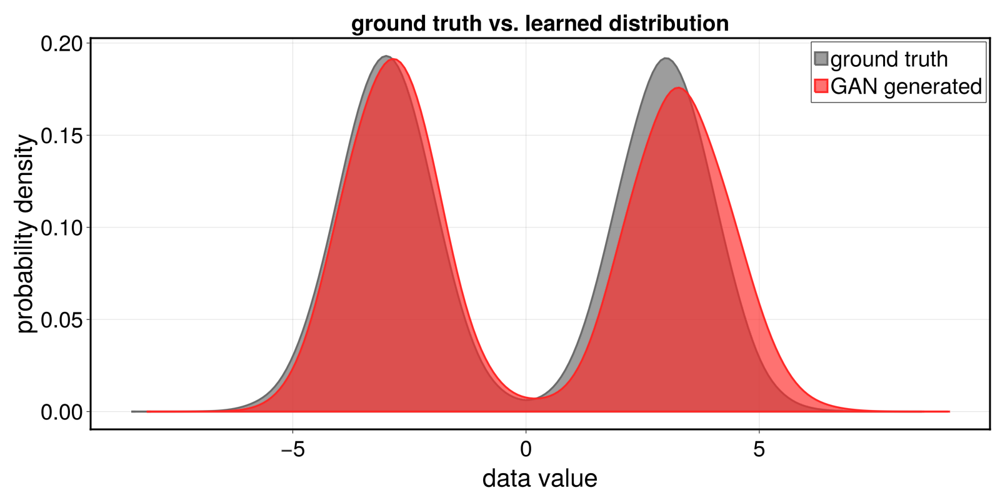

# HelloGAN.jl

Training a [generative adversarial network (GAN)](https://proceedings.neurips.cc/paper_files/paper/2014/file/5ca3e9b122f61f8f06494c97b1afccf3-Paper.pdf) using Julia Programming Language. 

## Use

1. Open REPL in the root directory: `julia`

2. Activate the package environment: `]activate .`

3. Precompile: `using GANExample`

4. Run training: `GANExample.train_gan()`